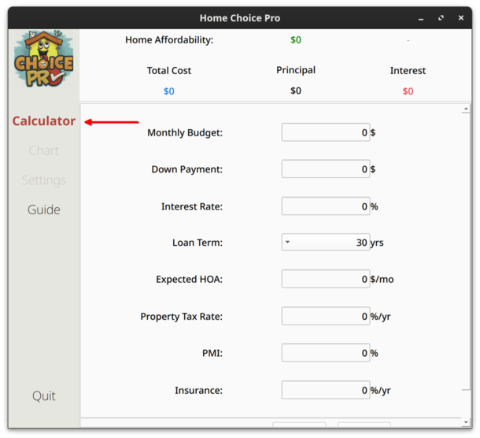
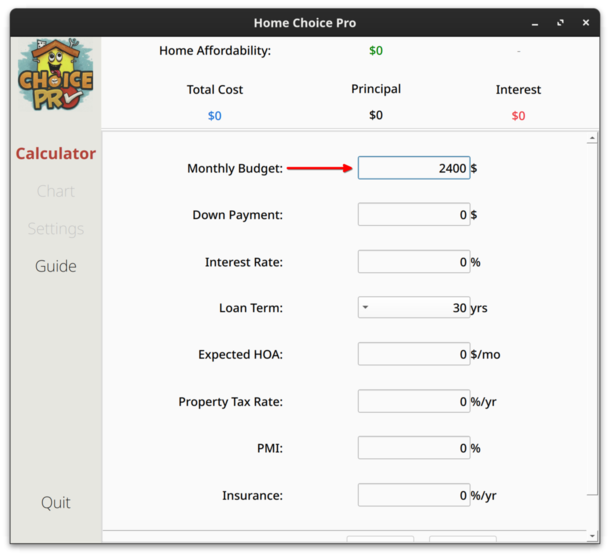
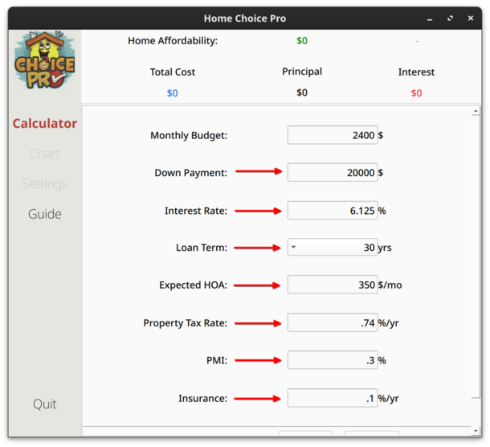
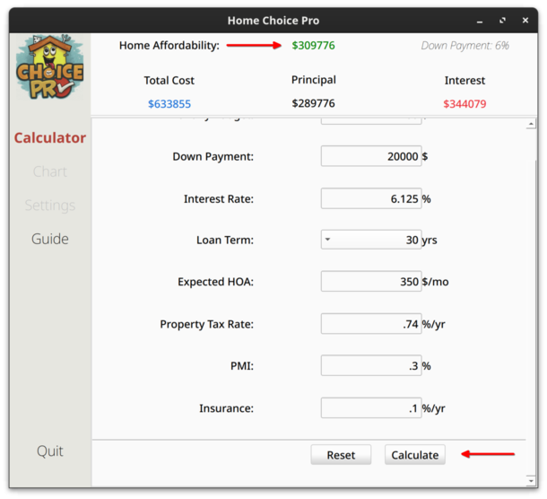
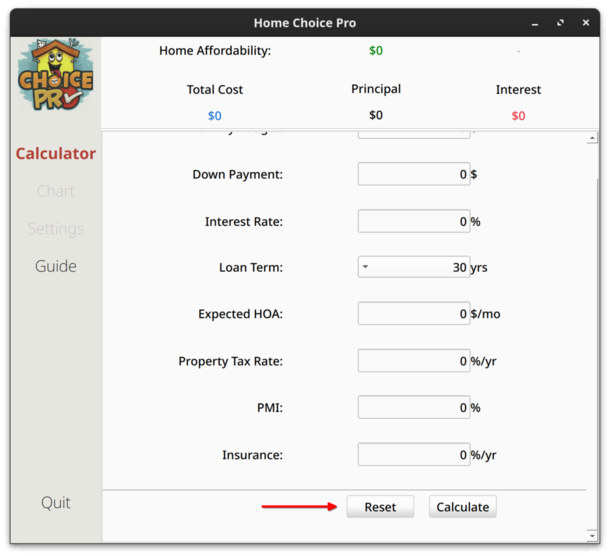
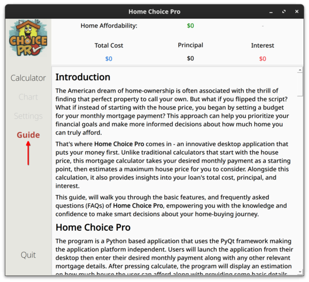
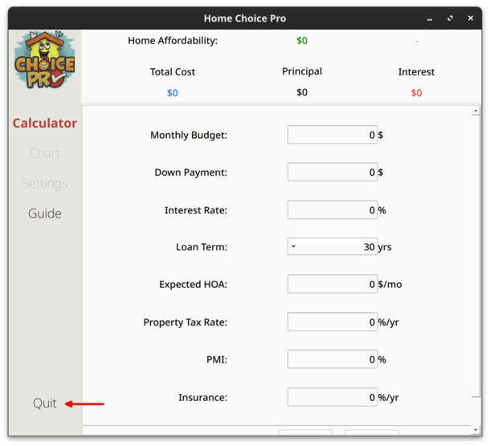

## Introduction
The American dream of home-ownership is often associated with the thrill of finding that perfect property to call your own. But what if you flipped the script? What if instead of starting with the house price, you began by setting a budget for your monthly mortgage payment? This approach can help you prioritize your financial goals and make more informed decisions about how much home you can truly afford.

That's where **Home Choice Pro** comes in - an innovative desktop application that puts your money first. Unlike traditional calculators that start with the house price, this mortgage calculator takes your desired monthly payment as a starting point, then estimates a maximum house price for you to consider. Alongside this calculation, it also provides insights into your loan's total cost, principal, and interest.

This guide, will walk you through the basic features, and frequently asked questions (FAQs) of **Home Choice Pro**, empowering you with the knowledge and confidence to make smart decisions about your home-buying journey.

## Home Choice Pro

The program is a Python based application that uses the PyQt framework making the application platform independent. Users will launch the application from their desktop then enter their desired monthly payment along with any other relevant mortgage details. After pressing calculate, the program will display an estimation on how much house the user can afford along with providing some basic details about a potential mortgage.

#### System Requirements

- MacOS 14.X or later
- Windows 11 (2024) or later
- Ubuntu (Linux) 24.04 or later

## Usage

### Basic Commands

- `Calculator`: Display home affordability mortgage calculator.
- `Guide`: Displays the user guide.
- `Quit`: Exits out of the program.
- `Reset`: Clears all inputs.
- `Calculate`: Calculates home affordability.

### Allowed Inputs

- **Numeric Fields:** Only numeric values (0-9) are allowed. Decimal points may be used where applicable.

### Features

**Home Choice Pro** includes the following features:
- Desired Monthly Payment
- Down Payment
- Interest Rate
- Loan Term
  - 15 years and 30 years
- Property Tax Rate
**Optional**
- Private Mortgage Insurance (PMI) 
- Expected HOA fee 

## Guide

Step 1:

When you open the application, the calculator defaults to the 'Calculate' tabs allowing estimation of your home affordability.

Step 2:

Enter your desired monthly payment. This should be the maximum amount you can afford per month in housing expenses. In general, it should be no more than 28 percent of your total income.

Step 3:

Enter estimated mortgage details.

Step 4:

Calculate your maximum budget for a house. Down payment percentage and loan details are displayed too.

Step 5:

Reset all details if you need to start over.

Step 6:

View this user guide in the application if you need further assistance.

Step 7:

Quit the application when you're finished.

## FAQ

***What is **Home Choice Pro**?***

**Home Choice Pro**, a cutting-edge online tool, revolutionizes the way potential homebuyers approach mortgage calculations. Unlike traditional calculators that start by providing house prices, **Home Choice Pro** flips this script by beginning with your desired monthly payment. By considering factors such as down payment, interest rate, loan term, and HOA fees, users can gain a comprehensive understanding of their overall financial commitment.

With **Home Choice Pro**, you'll receive personalized insights into what you can afford to spend on a home, including:

* Your estimated maximum house price
* Loan total cost: principal + interest

By starting with your desired monthly payment, this innovative calculator empowers you to make informed decisions about your mortgage and sets you up for success in the competitive housing market.

#### ***What information do I need to use the mortgage calculator?***

To use a mortgage calculator effectively, you need to input several pieces of information:
  - Desired Monthly Payment: The amount you are willing to pay monthly.
  - Down Payment: The initial up-front payment.
  - Interest rate: The rate at which interest will accrue on your loan.
  - Loan term: The length of time over which you will repay the loan, typically 15 or 30 years.
  - Property Tax Rate: The tax on a property.
  
  ***Optional inputs might include:***
  - Expected HOA Fee: Homeowners association fee to maintain all properties, shared amenities, and common areas within the association.
  - Private Mortgage Insurance: A type of insurance for certain mortgages with high loan-to-value ratios that protects the lender.

#### ***How accurate are mortgage calculators?***

While mortgage calculators can provide valuable insights into monthly or total payments, it's essential to recognize that they offer estimates rather than exact figures. These calculations often overlook crucial factors such as fluctuations in property taxes, insurance premiums, and changes in interest rates for adjustable-rate mortgages. Furthermore, maintenance costs and utilities are typically not included, which is vital information when considering the full scope of housing expenses.

As a result, mortgage calculators should be viewed as excellent starting points for initial planning and comparisons, but actual mortgage payments may vary slightly due to these variables and lender-specific requirements. To gain a more accurate understanding of your financial commitment, it's essential to consider all these factors and consult with a qualified professional before making a decision.

#### ***What is Private Mortgage Insurance?***

When a homebuyer takes out a home loan or refinances their mortgage, their lender may require to pay PMI. The national average ranges from 0.19% to 2.25%. The amount a homebuyer will pay is based on two factors: 
- the total loan amount: PMI costs are usually higher for larger mortgages
- the homebuyers credit score: Lenders usually charge those with higher credit scores lower PMI percentages
Lenders may require it depending on the loan-to-value (LTV) ratio. If the homebuyer needs PMI, the lender will choose the provider of their choice. Typically, lenders will require homeowners to pay PMI while their LTV is above 80%. Once their LTV is below 80%, the homebuyer can request to stop paying PMI.

#### ***What is HOA?***

HOAs (Homeowners Associations) are communities that create rules for properties and residents. If you buy a home within an HOA's jurisdiction, you'll need to pay their fees - it's not optional.

Before buying, understand the HOA's rules, as they can be strict about things like property changes or decorations. The HOA is made up of community residents, and fees depend on factors like location, number of properties, amenities, and type of property.

On average, HOA fees cost between $100 to $1,000 per year. Fees are used for common area maintenance, renovation projects, and emergencies.

#### ***What are property taxes?***

As an owner of real estate within a government jurisdiction, you're required to pay property taxes annually or semi-annually. These taxes are used to fund essential services that benefit your community, including:

* Schools
* Police departments
* Fire departments
* Libraries
* Local infrastructure and development projects

The amount of property tax varies depending on the location, with rates ranging from 0.31% to 1.64%. For example, if you own a $200,000 home in an area with a 0.5% property tax rate, your annual taxes would be $1,000.

### Additional Considerations

* **Further Expenses**: Our calculator doesn't account for additional costs associated with home ownership, such as appraisal fees, title search fees, and maintenance costs.
* **Accuracy**: The accuracy of results depends on the accuracy of information provided. Ensure all inputs are correct and up to date for accurate estimates.
* **Financial Decisions**: Any financial decisions should not be based solely on calculator results. We strongly advise seeking professional financial advice tailored to your personal circumstances before making any mortgage-related decisions.
* **Responsibility**: By using this calculator, you acknowledge that the application developers and affiliates are not responsible for inaccuracies or conclusions derived from its use. You assume full responsibility for any risks associated with the tool's use.

### Disclaimer  

* **Estimates Only**: Figures produced by our mortgage calculator are estimates only and should not be relied upon as definitive financial advice.
* **No Guarantee of Loan Approval**: Using this tool does not guarantee loan approval, as lenders consider various factors when assessing your application.
* **Interest Rates**: Interest rates used in calculations are for illustrative purposes only and may not reflect current market rates or individual profiles.

### Acknowledgements

We would like to thank the following individuals for their contributions:
* **Jose (Joey) Garcia**
* **Zaria Gibbs**
* **Randy Shreeves**
* **Josh Voyles**

### License

The GNU General Public License (GPL) version 3.0 is an open-source software licensing agreement that allows users to freely use, modify, and distribute software. Licensing key points:

* **Free Redistribution**: You can copy, modify, and redistribute the licensed software as you see fit.
* **Source Code Availability**: The source code of the software must be made available under the same license terms.
* **Modification Freedom**: You're allowed to make changes to the original software, but any modifications must also be distributed under the GPL 3.0 license.
* **No Discrimination Against Persons or Groups**: The license doesn't discriminate against individuals or groups based on their nationality, race, gender, etc.
* **No Restrictions on Other Software**: You're free to use and distribute other software alongside the licensed software.
